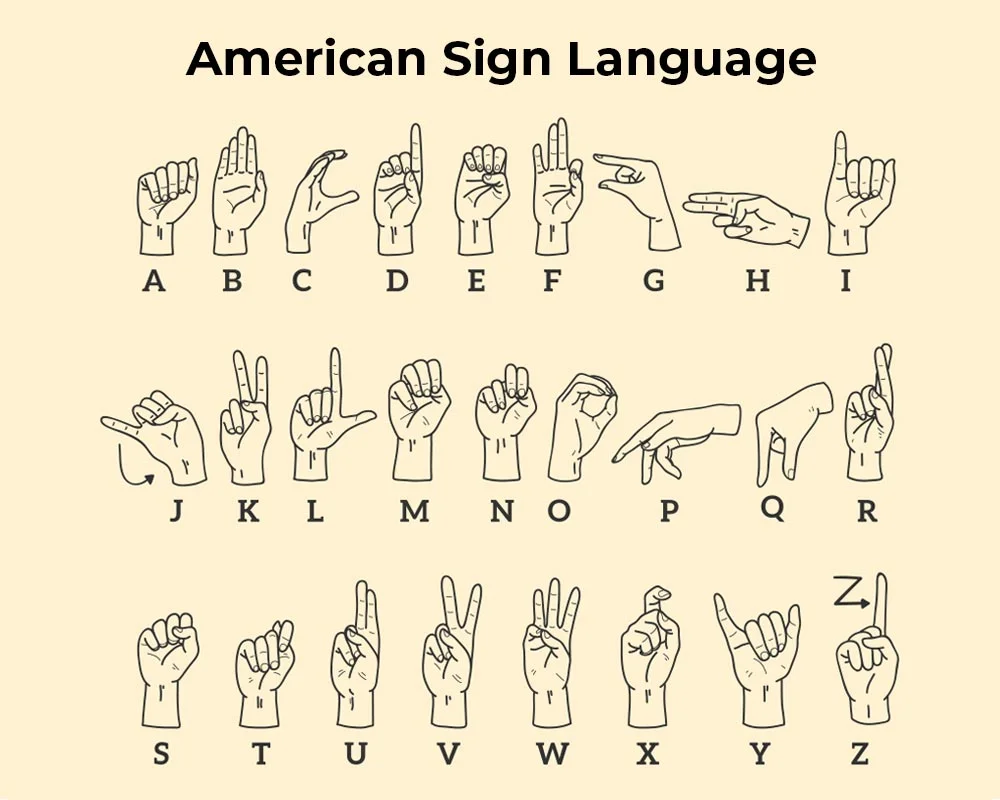

## Gesture to speech
___

This project is created for the AI hackathon 2024

### Functionalities  to implement
 
- [ ] Pose detection of the hands
- [ ] Left hand 
- [ ] Right hand
- [ ] Fingers
- [ ] Face detection
- [ ] Position of the hands and the head
- [ ] Recognise sign language

### Stack

1. Python 3.11
2. OpenCV
3. 

### Sources

### Approach

#### Detection

  1. Detect the ears, eyes, chin
  2. Detect each position of each finger

#### Data gathering 
 
  1. Cut videos and label them 
  2. Process them with the detection software and store the detected data in json.
  3. Train the model
  4. Test 

#### 1. Add the American sign spelling   

1. Detect the hand
2. Detect the bones 
3. Detect the shape
4. Detect the letter 

#### 2. Add more complex signs 
1. Detect the hand
2. Detect the bones
3. Detect the shape
4. Detect the word

